# 第1章  计算机系统概述

## 1.1  操作系统的基本概念

1. 并发：同一时间间隔。并行：同一时间段
2. 共享，并发和共享是操作系统两个最基本特征。
3. 虚拟
4. 异步

## 1.2  操作系统的发展历程

1. 批处理操作系统

   单道批处理系统：将一批作业以脱机的方式输入磁带。缺陷：每次主机内存中仅存放一道作业。若一道程序请求I/O，则暂停，高速的CPU处于等待低速的I/O完成的状态。

   多道批处理系统：用户提交的作业存放在外存中并拍成队列，按调度算法调入内存中。宏观上并行，实际串行。若一道程序请求I/O则暂停，则CPU转而去执行另一道程序  （中断）。

   

   缺点：不提供人机交互的能力

2. 分时操作系统

   分时操作系统是指多个用户通过终端同时共享一台主机，这些终端连接在主机上，用户可以同时与主机进行交互操作而互不干扰。

3. 实时操作系统

   硬实时系统（要求绝对），软实时系统

4. 分布式操作系统

   分布性和并行性

## 1.3  操作系统的运行环境

1. 特权指今：是指不允许用户直接使用的指令，如I/O指令、关中断指令、内存清零指令，存取用于内存保护的寄存器、送PSW到程序状态字寄存器等的指令。

   非特权指令，是指允许用户直接使用的指令，它不能直接访问系统中的软硬件资源，仅限访问用户的地址空间。

2. CPU的运行模式：

   用户态（目态）和核心态（又称管态、内核态）

   应用程序运行在用户态，橾作系统内核程序运行在核心态。

   访管指令是在用户态执行的，因此是非特权指令。

3. 中断

   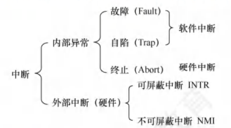

4. 中断处理和子程序调用的比较

   注意区分中断处理和子程序调用：

   ①中断处理程序与被中断的当前程序是相互独立的，它们之间没有确定的关系；子程序与主程序是同一程序的两部分，它们属于主从关系。

   ②通常中断的产生都是随机的；而子程序调用是通过调用指令(CALL)引起的，是由程序设计者事先安排的。

   ③调用子程序的过程完全属于软件处理过程；而中断处理的过程还需要有专门的硬件电路才能实现。

   ④中断处理程序的入口地址可由硬件向量法产生向量地址，再由向量地址找到入口地址；子程序的入口地址是由CALL指令中的地址码给出的。

   ⑤调用中断处理程序和子程序都需要保护程序计数器(PC)的内容，前者由中断隐指令完成，后者由CALL指令完成（执行CALL指令时，处理器先将当前的PC值压入栈，再将PC设置为被调用子程序的入口地址）。

   ⑥响应中断时，需对同时检测到的多个中断请求进行裁决，而调用子程序时没有这种操作。

5. 系统调用

   **用户态   –系统调用–>  内核态**

   凡是与资源有关的操作（如存储分配、I/O传输及管理文件等），都必须通过系统调用方式向操作系统提出服务请求，并由橾作系统代为完成。

   

   用户程序执行“陷入指令”，相当于将CPU的使用权主动交给橾作系统内核程序(CPU状态会从用户态进入核心态），之后操作系统内核程序再对系统调用请求做出相应处理。处理完成后，操作系统内核程序又会将CPU的使用权还给用户程序(CPU状态会从核心态回到用户态）。

   

   从核心态转向用户态由一条指令实现，这条指令也是特权命令，一般是中断返回指令。

## 1.4  操作系统结构

1. 分层法

   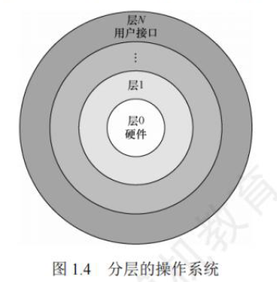

2. 模块法

   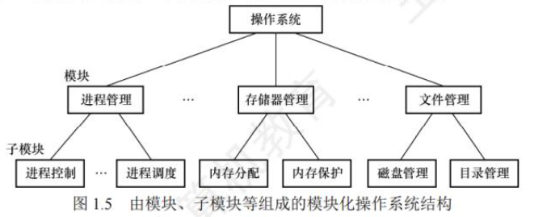

3. 从操作系统的内核架构来划分，可分为宏内核和微内核

   宏内核，也称单内核或大内核，是指将系统的主要功能模块都作为一个紧密联系的整体运行在核心态，从而为用户程序提供高性能的系统服务。因为各管理模块之间共享信息，能有效利用相互之间的有效特性，所以具有无可比拟的性能优势。

   

   微内核，是指将内核中最基本的功能保留在内核

------

# 第二章  进程与线程

## 2.1  进程与线程

1. 由代码段，数据段，进程控制块(PCB)构成了进程实体(进程映像)。

2.  

   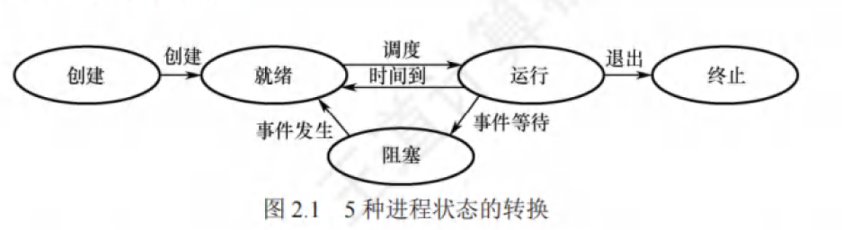

   阻塞态进程等待的事件完成后，会从阻塞态转到就绪态，等待CPU。

   唤醒原语(Wakeup)，阻塞原语(Block)

3. 线程控制块(TCB)

## 2.2  CPU调度

1. 调度的层次

   （1）高级调度（作业调度）：内存与外存之间的调度

   （2）中级调度（内存调度）：将暂时不能执行的进程放入外存中，称为挂起态

   （3）低级调度（进程调度）

2. 调度的目标：CPU利用率、系统吞吐量、周转时间（指从作业提交到作业完成所经历   的时间）、等持时间、响应时间。

3. 进程切换

   对于通常的进程而言，其创建、撤销及要求由系统设备完成的J/0操作，都是利用系统调用而进入内核，再由内核中的相应处理程序予以完成的。进程切换同样是在内核的支持下实现的。

   

   上下文切换（只发生在内核态）

      1)挂起一个进程，将CPU上下文保存到PCB,包括程序计数器和其他寄存器。

      2)将进程的PCB移入相应的队列，如就绪、在某事件阻塞等队列。

      3)选择另一个进程执行，并更新其PCB。

      4)恢复新进程的CPU上下文。

      5)跳转到新进程PCB中的程序计数器所指向的位置执行。

4. 调度算法

   （1）先来先股务(FCFS)调度算法：对长作业比较有利，但对短作业不利（相对 SJF和高响应比）：有利于CPU繁忙型作业，而不利于I/O繁忙型作业。

   （2）短作业优先(SJF)调度算法：分为抢占式和非抢占式，会产生“饥饿”（总是优先调度那些（即使是后进来的）短作业，将导致长作业长期不被调度），平均等待时间、平均周转时间是最优的。

   （3）高响应比优先调度算法：克服了“饥饿”

   （4）优先级调度算法：非抢占式、抢占式

   ​	抢占式：

   ​		静态优先级（不变）

   ​		动态优先级：进程优先级的设置可以参照以下原则：

   ​				      1）系统进程＞用户进程

   ​				      2）交互型进程＞非交互型进程（或前台进程＞后台进程）

   ​				      3）I/O型进程＞计算型进程(CPU)

   （5）时间片轮转(RR)调度算法：绝对可抢占（时间片一耗尽，当前进程必须撤下）

   （6）多级队列调度算法：设置多个就绪队列，将不同类型或性质的进程固定分配到不同的就绪队列。每个队列可实施不同的调度算法。

   （7）多级反馈队列调度算法

## 2.3  同步和互斥

1. 同步：保证进程/线程按规定的顺序执行，可能允许多个同时运行，但必须在特定点配合。

   互斥：同一时间只能有一个进程/线程访问某个共享资源（临界资源）。

   为禁止两个进程同时进入临界区，同步机制应遵循以下准则：

      空闲让进、忙则等待、有限等待、让权等待（原则上应该遵循，但非必须）。

2. 实现临界区互斥的方法

   （1）软件实现：
   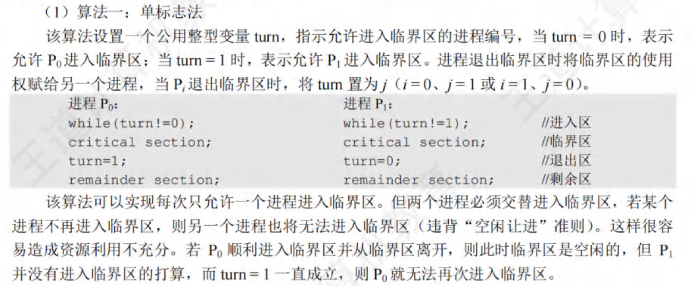

   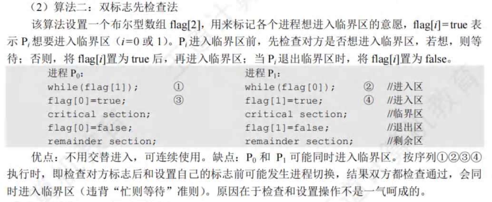

   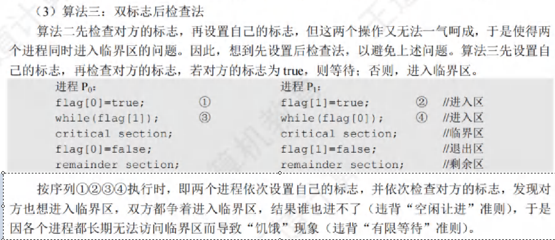

   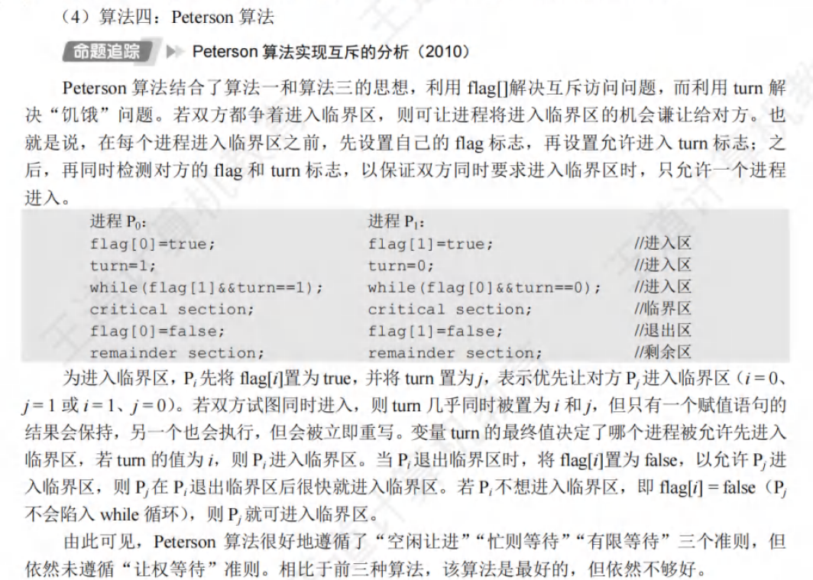

   （2）硬件实现：

   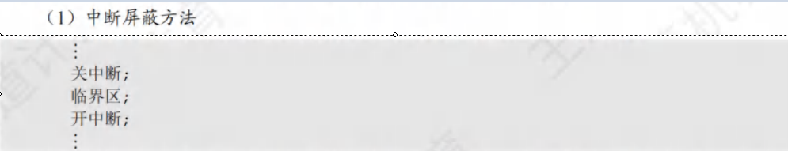

   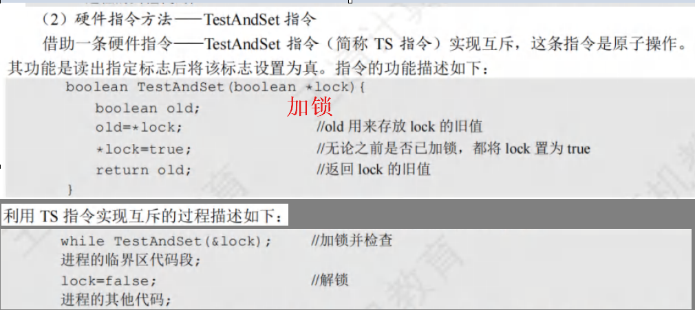

   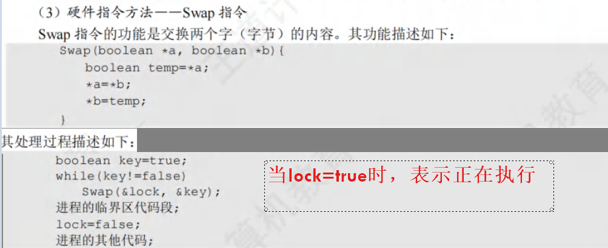

3. 互斥锁、信号量。

4. 经典同步问题

   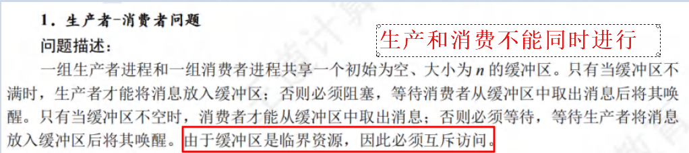

   ```c
   // 信号量定义
   semaphore mutex = 1;    // 互斥信号量
   semaphore empty = N;    // 空槽数
   semaphore full  = 0;    // 产品数
   
   // 缓冲区
   buffer[N];
   int in = 0, out = 0;
   
   // 生产者进程
   producer() 
   {
       while (true) 
       {
           item = produce_item(); // 生产一个产品
   
           P(empty);    // 等待有空槽
           P(mutex);    // 进入临界区
   
           buffer[in] = item;
           in = (in + 1) % N;
   
           V(mutex);    // 离开临界区
           V(full);     // 增加产品数
       }
   }
   
   // 消费者进程
   consumer() 
   {
       while (true) 
       {
           P(full);     // 等待有产品
           P(mutex);    // 进入临界区
   
           item = buffer[out];
           out = (out + 1) % N;
   
           V(mutex);    // 离开临界区
           V(empty);    // 增加空槽数
   
           consume_item(item); // 消费产品
       }
   }
   ```

   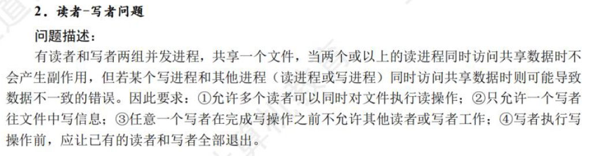

   ```c
   //读进程优先：可能会导致写进程“饿死”
   
   //信号量定义：
   semaphore mutex = 1;    // 保护读者计数
   semaphore wrt   = 1;    // 保护写操作
   int readcount = 0;       // 当前读者数
   
   //读者进程：
   reader() 
   {
       while (true) 
       {
           P(mutex);                // 进入临界区，更新读者计数
           readcount++;
           if (readcount == 1)      // 第一个读者阻止写者
               P(wrt);
           V(mutex);                // 离开临界区
   
           // 临界区：可以读数据
           read_data();
   
           P(mutex);                // 进入临界区，更新读者计数
           readcount--;
           if (readcount == 0)      // 最后一个读者释放写锁
               V(wrt);
           V(mutex);                // 离开临界区
       }
   }
   
   //写者进程：
   writer() 
   {
       while (true) 
       {
           P(wrt);                  // 等待没有读者或其他写者
           write_data();             // 临界区写操作
           V(wrt);                  // 写完释放写锁
       }
   }
   ```

   ```c
   //写进程优先：不会“饥饿”
   
   //信号量定义：
   semaphore mutex = 1;        // 保护读者计数
   semaphore wrt   = 1;        // 保护写操作
   semaphore readTry = 1;      // 读者尝试进入标志，阻止新读者插队
   int readcount = 0;           // 当前读者数
   
   //读者进程：
   reader() 
   {
       while (true) 
       {
           P(readTry);            // 防止新读者插队，给写者优先
           P(mutex);              
           readcount++;
           if (readcount == 1)    // 第一个读者阻止写者
               P(wrt);
           V(mutex);
           V(readTry);            // 允许其他读者尝试进入
   
           read_data();            // 临界区读操作
   
           P(mutex);
           readcount--;
           if (readcount == 0)     // 最后一个读者释放写锁
               V(wrt);
           V(mutex);
       }
   }
   
   //写者进程：
   writer() 
   {
       while (true) 
       {
           P(readTry);            // 阻止新读者进入
           P(wrt);                // 等待当前读者退出或其他写者
           write_data();          // 临界区写操作
           V(wrt);
           V(readTry);            // 允许读者进入
       }
   }
   ```

   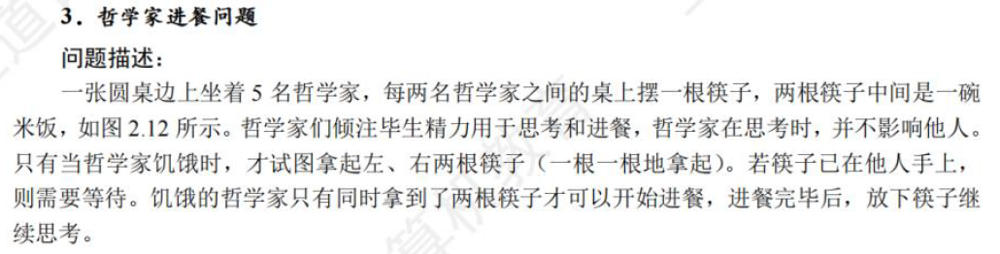

   ```c
   //信号量定义
   semaphore chopstick[5];   // 五个叉子，初始值 = 1
   
   philosopher(i):   // i = 0..4 表示哲学家编号
       while (true) 
       {
           think();   // 哲学家思考
   
           // 尝试拿起左边和右边的叉子（互斥访问）
           if (i % 2 == 0) 
           {
               P(chopstick[i]);           // 先拿左边叉子
               P(chopstick[(i+1)%5]);     // 再拿右边叉子
           } 
           else 
           {
               P(chopstick[(i+1)%5]);     // 先拿右边叉子
               P(chopstick[i]);           // 再拿左边叉子
           }
   
           eat();    // 吃饭
   
           // 放下叉子
           V(chopstick[i]);
           V(chopstick[(i+1)%5]);
       }
   ```

   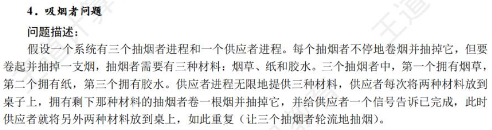

   ```c
   //信号量定义
   semaphore tobacco = 0;    // 放烟草信号
   semaphore paper   = 0;    // 放纸信号
   semaphore match   = 0;    // 放火柴信号
   semaphore agent   = 1;    // 互斥访问桌子
   
   //中介者/供应者（Agent）
   agent():
       while true:
           P(agent);  // 等待桌子空闲
           choose two random ingredients
           if ingredients == (paper + match):
               V(tobacco);    // 通知拥有烟草的吸烟者
           else if ingredients == (tobacco + match):
               V(paper);      // 通知拥有纸的吸烟者
           else if ingredients == (tobacco + paper):
               V(match);      // 通知拥有火柴的吸烟者
   
   //吸烟者进程
   //拥有烟草的吸烟者
   smoker_with_tobacco():
       while true:
           P(tobacco);   // 等待桌上出现纸和火柴
           make_cigarette();
           smoke();
           V(agent);     // 桌子空闲，通知中介者
   
   //拥有纸的吸烟者
   smoker_with_paper():
       while true:
           P(paper);     // 等待桌上出现烟草和火柴
           make_cigarette();
           smoke();
           V(agent);
   
   //拥有火柴的吸烟者
   smoker_with_match():
       while true:
           P(match);     // 等待桌上出现烟草和纸
           make_cigarette();
           smoke();
           V(agent);
   ```

5. 管程：是一种高级同步机制，用于安全地访问共享资源，它结合了互斥和条件同步的功能。一个管程是一个模块化的抽象数据类型。

## 2.4  死锁

1. 死锁：是指多个进程困竞争资源而造成的一种僵局（互相等待对方手里的资源），使得各个进程都被阻塞，若无外力干涉，这些进程都无法向前推进。

2. 死锁和饥饿的主要差别：①发生饥饿的进程可以只有一个；而死锁是因循环等待对方手里的资源而导致的，因此，如果有死锁现象，那么发生死锁的进程必然大于或等于两个。②发生饥饿的进程可能处于就绪态（长期得不到CPU,如SJF算法的问题），也可能处于阻塞态（如长期得不到所需的I/O设备，如上述举例）；而发生死锁的进程必定处于阻塞态。

3. 只有对不可剥夺资源的竞争才可能产生死锁，对可剥夺资源（如CPU和内存）的竞争是不会引起死锁的。

4. 死锁产生的必要条件：资源互斥、循环等待、请求且保持、不可剥夺。

5. 死锁预防：预防死锁的发生只需破坏死锁产生的4个必要条件之一即可。

6. 死锁避免：

   （1）系统安全状态：在进行资源分配之前，应先计算此次分配的安全性。安全状态，是指系统能按某种进程推进顺序，满足每个进程对资源的最大需求。

   （2）银行家算法：

7. 死锁的检测和解除

------

# 第三章  内存管理

## 3.1  内存管理概念

1. 编译后，每个目标模块都从0号单元开始编址，这称为该目标模块的相对地址（或逻辑地址）。

2. 内存保护：内存分配前，需要保护操作系统不受用户进程的影响，同时保护用户进程不受其他用户进程的影响。

   (1)在CPU中设置一对上、下限寄存器，存放用户进程在主存中的下限和上限地址，每当CPU要访问一个地址时，分别和两个寄存器的值相比，判断有无越界。

   (2)采用重定位寄存器（也称基地址寄存器）和界地址寄存器（也称限长寄存器）进行越界检查。重定位寄存器中存放的是进程的起始物理地址，界地址寄存器中存放的是进程的最大逻辑地址。内存管理部件将逻辑地址与界地址寄存器进行比较，若未发生地址越界，则加上重定位寄存器的值后映射成物理地址，再送交内存单元。

3. 连续分配管理方式（内存管理）

   (1)单一连续分配

   (2)固定分区分配      内部碎片(内部分区)

   (3)动态分配             外部碎片(内存中)

   ​	①基于顺序搜索的分配算法：首次适应(First Fit)算法、邻近适应(Next Fit)算法、	最佳适应(Best Fit)算法、最坏适应(Worst Fit)算法。

   ​	②基于索引搜索的分配算法：快速适应算法、伙伴系统、哈希算法。

   

   ​	动态分区分配的内存回收方法：与固定分区分配类似，设置一张空闲分区链表，	可以按始址排序。

4. 基本分页存储管理

   详见计算机组成原理3.6

## 3.2  虚拟内存管理

1. 驻留集，工作集
2. 页面置换算法：最佳(OPT)置换算法、先进先出(FIFO)页面置换算法、最近最久未使用(LRU)置换算法、时钟(CLOCK)置换算法。

------

# 第四章  文件管理

## 4.1  文件系统基础

1. 文件控制块(FCB)

2. 对文件访问控制常由[用户访问权限]和[文件属性]共同限制

3. 

   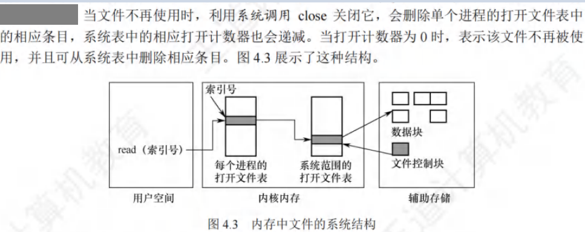

4. open()   系统调用(系统io)

5. 文件的逻辑结构

   (1)无结构文件

   ​	是最简单的文件组织形式，它是由字符流构成的文件，所以又称流式文件，其长	度以字节为单位。

   (2)有结构文件

   ​	①顺序文件：在对记录进行批量操作，即每次要读或写一大批记录时，顺序文件	的效率是所有逻辑文件中最高的。此外，对于顺序存储设备（如磁带），也只有	顺序文件才能被存储并能有效地工作。在经常需要查找、修改、增加或删除单个	记录的场合，顺序文件的性能较差。

   ​	②索引文件：索引文件由于需要配置索引表，且每个记录都要有一个索引项，因	此增加了存储开销。

   ​	③索引顺序文件

6. 文件的物理结构

   (1)连续分配

   ​	优点：①支待顺序访问和直接访问。②顺序访问容易且速度快，文件所占用的块	可能位于一条或几条相邻的磁道上，磁头的移动距离最小。

   ​	缺点：①要为一个文件分配连续的存储空间，与内存分配类似，为文件分配连续	的存储空间会产生很多外部碎片。②必须事先知道文件的长度，也无法满足文件	动态增长的要求，否则会覆盖物理上相邻的后续文件。③为保待文件的有序性，	删除和插入记录时，需要对相邻的记录做物理上的移动。

   (2)链接分配

   ​	①隐式链接

   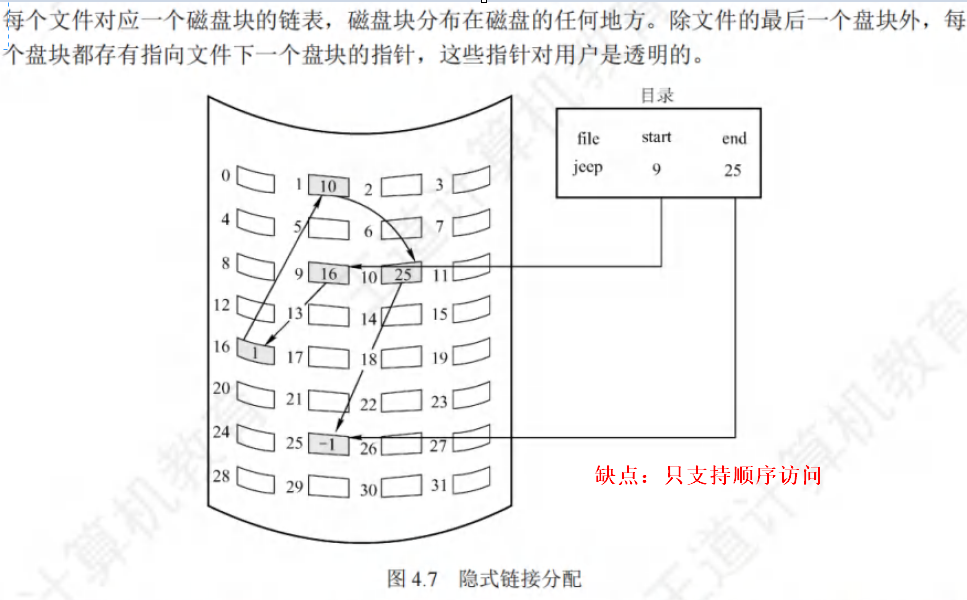

   ​	②显示链接：用于链接文件各物理块的指针，显式地存放在内存的一张链接表	中，该表在整个磁盘中仅设置一张，称为文件分配表(FAT）。	

   (3)索引分配

   ​	①单级索引

   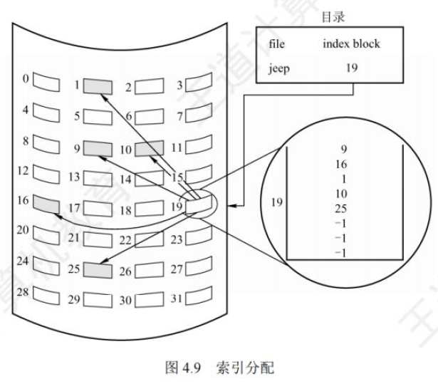

   ​	②多级索引

   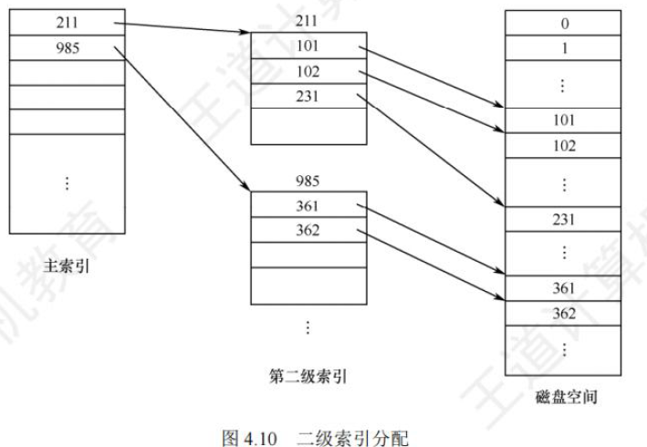

   ​	③混合索引

   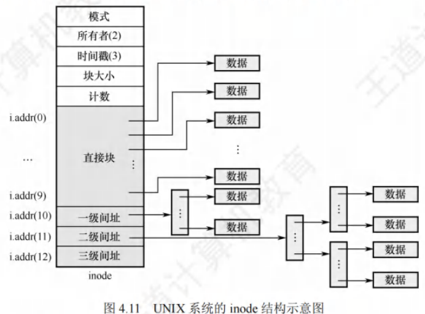	

## 4.2  目录

1. 文件共享

   基于索引节点的共享方式（硬链接），利用符号链实现文件共享（软链接）

   硬链接就是多个指针指向一个索引节点，保证只要还有一个指针指向索引节点，索引节点就不能删除：软链接就是将到达共享文件的路径保存下来，当要访问文件时，根据路径寻找文件。可见，硬链接的查找速度要比软链接的快。

## 4.3  文件系统

1. 磁盘空闲空间管理方法：空闲表法、空闲链表法、位示图法、成组链接法。

------

# 第五章  输入/输出（I/O）管理

## 5.1  I/O管理概述

1. 

   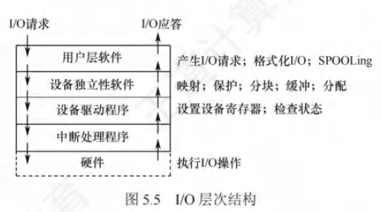

## 5.2  设备独立性软件

1. 缓冲区(Buffer)：

   在设备管理子系统中，引入缓冲区的目的主要如下：①缓和CPU与I/O设备间速度不匹配的矛盾。②减少对CPU的中断频率，放宽对CPU中断响应时间的限制。③解决基本数据单元大小（数据粒度）不匹配的问题。④提高CPU和I/O设备之间的并行性。

   

   缓冲区的实现方法如下：①采用硬件缓冲器，但由于成本太高，除一些关键部位外，一般不采用硬件缓冲器。②利用内存作为缓冲区

   **(1)单缓冲（Single Buffer）**

   - 原理：在内存中设置一个缓冲区，CPU 与 I/O 设备共享它。
   - 过程：
     1. CPU 把数据放入缓冲区；
     2. I/O 设备从缓冲区取数据（或相反）。
   - 优点：简单，能避免 CPU 和 I/O 完全串行执行。
   - 缺点：I/O 和 CPU 仍可能因为等待缓冲区而互相阻塞，效率有限。

   **(2)双缓冲（Double Buffering）**

   - 原理：准备两个缓冲区，CPU 和 I/O 可以“并行”操作。
   - 过程：
     - 当 I/O 设备向缓冲区 A 写数据时，CPU 可以从缓冲区 B 取数据；
     - 下一个阶段二者交换角色。
   - 优点：减少 CPU 和 I/O 的等待时间，提高并行度。
   - 缺点：需要多一块缓冲区的存储空间。

   **(3)循环缓冲（Circular Buffer） / 环形缓冲**

   - 原理：把多个缓冲区组织成环形队列，读写指针循环移动。
   - 过程：
     - I/O 设备不断向环中填充数据；
     - CPU 按顺序从环中取数据。
   - 优点：能适应数据流连续输入输出，避免数据丢失。
   - 典型应用：串口通信、音视频数据流。

   **(4)缓冲池（Buffer Pool）**

   - 原理：系统维护一个由多个缓冲区组成的池，供多个进程或设备共享。
   - 类型：常见划分方式是 空缓冲区队列 和 满缓冲区队列。
   - 过程：
     - I/O 完成时，数据放入“满缓冲区队列”；
     - CPU 取数据时，从满队列取出并处理，再放回“空队列”。
   - 优点：适合多进程、多设备并发，提高资源利用率。

2. 设备分配与回收

   一、设备分配的原则

   设备分配要解决的核心问题是：当多个进程竞争有限的 I/O 设备时，如何公平、高效、安全地分配。

   (1)分配原则

   1. 独占性原则
      - 有些设备必须独占（如打印机），不能多个进程同时使用。
   2. 共享性原则
      - 部分设备可被多个进程共享（如磁盘、键盘输入流），通过缓冲区或调度算法协调。
   3. 公平性与优先级
      - 可能按先进先出（FIFO）或按优先级来分配，保证重要进程优先获得设备。

   (2)设备分配方式

   - 静态分配
     - 在作业开始时就分配好所需设备，直到作业结束才释放。
     - 简单，但设备利用率低。
   - 动态分配
     - 进程在执行中需要时申请，完成后立即释放。
     - 提高利用率，更灵活，但管理更复杂。

   二、设备分配的数据结构

   操作系统通常会建立 设备控制表（DCT）、控制器控制表（COCT） 和 通道控制表（CHCT） 等，记录设备的使用状态和归属。

   常见信息包括：

   - 设备标识
   - 设备状态（忙/闲）
   - 占用设备的进程队列
   - 控制器信息、通道信息

   三、设备分配的过程

   1. 申请设备
      - 进程通过系统调用请求设备。
   2. 检查设备空闲性
      - 如果设备空闲，则分配并修改状态为“忙”。
      - 如果设备被占用：
        - 若是可共享设备 → 允许多个进程同时使用；
        - 若是独占设备 → 将进程挂起，加入等待队列。
   3. 建立连接
      - 操作系统在进程与设备之间建立 I/O 通道连接。

   常见的设备分配算法:

   ​	先来先服务（FCFS）：公平，但效率不一定高。

   ​	优先级分配：保证关键进程优先。

   ​	按需分配：结合缓冲池技术，动态满足进程的 I/O 请求。

   四、设备回收

   1. 主动释放
      - 进程完成 I/O 操作后，调用系统调用释放设备。
   2. 被动释放
      - 进程异常终止，操作系统会自动回收它占用的设备。
   3. 回收操作
      - 修改设备状态为空闲；
      - 唤醒等待队列中的进程，按调度策略分配设备。

3. SPOOLing技术（假脱机技术）（空间换时间）

   本质：用磁盘等快速存储设备 模拟独占设备的输入/输出缓冲区，让独占设备变成共享设备。

   作用：解决 慢速独占型 I/O 设备（如打印机、打卡机）和 CPU 高速工作之间的矛盾。

   

   SPOOLing 的系统组成：

   ​	输入井：存放外设输入数据的磁盘区域；

   ​	输出井：存放用户作业输出结果的磁盘区域；

   ​	常驻内存的进程：

   ​		输入进程：负责把输入设备的数据放到输入井；

   ​		输出进程：负责把输出井的数据交给独占设备（如打印机）。

   

   若没有SPOOLing技术，CPU要向打印机输出要打印的数据，打印机的打印速度比较慢，CPU就必须迁就打印机，在打印机将数据打印完后才能继续做其他的工作，浪费了CPU的不少时间。在SPOOLing技术下，CPU要打印机打印的数据可以先输出到磁盘的**输出井**中（这个过程由假脱机进程控制），然后做其他的事悄。若打印机此时被占用，则 SPOOLing系统就会将这个打印请求挂到等待队列上，待打印机有空时再将数据打印出来。向磁盘输出数据的速度比向打印机输出数据的速度快，因此就节省了时间。

   (1)输入假脱机（Input Spooling）

   ​	①用户提交作业 → 输入设备（如键盘、读卡机）把数据送给输入进程。

   ​	②输入进程接管 → 操作系统的输入进程把数据暂存在磁盘的 输入井 中。

   ​	③作业调度 → 当系统调度该作业时，再把输入井的数据调入内存，供 CPU 执行。

   (2)输出假脱机（Output Spooling）

   ​	①用户程序执行 → 产生的输出结果交给操作系统的 输出进程。

   ​	②存入输出井 → 输出进程将结果先存入磁盘的 输出井。

   ​	③输出调度 → 当独占设备（如打印机）空闲时，输出进程再从输出井中取出数据送到设备。

   ​	④设备执行输出 → 打印机（或其他设备）按顺序完成输出。

## 5.3  磁盘和固态硬盘

1. 磁盘调度算法

   磁盘调度的目标是：

   - 减少平均寻道时间
   - 减少平均响应时间
   - 提高磁盘带宽利用率

   

   (1)先来先服务（FCFS, First Come First Serve）

   - 思想：按请求到达的先后顺序调度。
   - 优点：公平、实现简单。
   - 缺点：寻道时间可能很大，效率低。

   (2)最短寻道时间优先（SSTF, Shortest Seek Time First）

   - 思想：选择距离当前磁头最近的请求。
   - 优点：比 FCFS 平均寻道时间少。
   - 缺点：可能导致“饥饿”，远处的请求长期得不到满足。

   (3)扫描算法（SCAN，电梯算法）

   - 思想：磁头在一个方向上移动，依次服务沿途的请求，直到尽头再反向。
   - 优点：避免远端饥饿，比 SSTF 公平。
   - 缺点：边缘的请求等待时间可能较长。

   (4)循环扫描算法（C-SCAN, Circular SCAN）

   - 思想：磁头只向一个方向移动，服务完最远端请求后，立即回到起点，再次扫描。
   - 优点：比 SCAN 更加均衡，请求等待时间差异小。
   - 缺点：回程时磁头空跑，增加了开销。

   (5)LOOK 和 C-LOOK 算法

   - LOOK：类似 SCAN，但磁头只移动到最远的请求处就掉头，而不是磁盘尽头。
   - C-LOOK：类似 C-SCAN，但磁头只回到最远的请求位置，不必到磁盘尽头。


