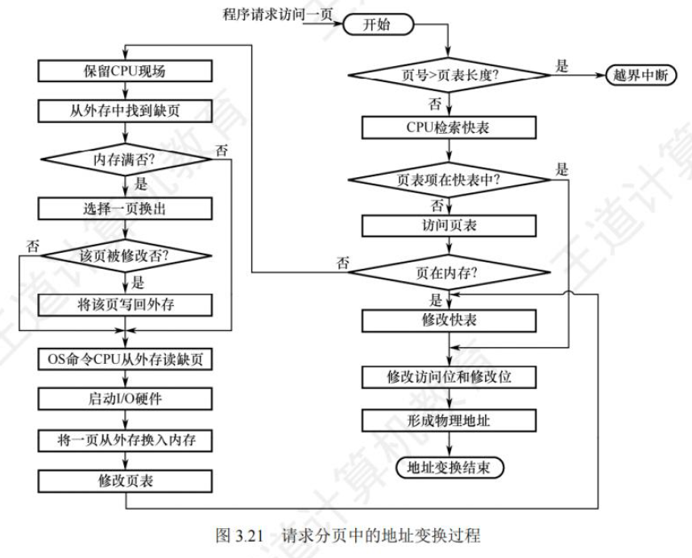

## 1.时分复用、空分复用

**时分复用技术（如虚拟处理器）**：
	操作系统通过 时间片轮转、调度算法 等方式，把处理器的时间划分为很小的片段，交替分配给各个任务。
结果：
	每个进程都“感觉”自己独占了 CPU。
	实际上是操作系统通过快速切换上下文，让一个物理处理器被抽象成了多个虚拟处理器

**空分复用技术（如虚拟存储器）**：
	操作系统通过 地址空间抽象（分页、分段、虚拟内存机制），把有限的物理内存划分并映射给不同进程。
结果：
	每个进程都“感觉”自己独占了一个完整的、连续的内存空间。
	实际上 OS 把不同进程的虚拟地址空间映射到物理内存的不同部分，甚至利用磁盘扩展（swap）

------

## 2.为什么用虚拟空间，空间就好像变大了

例如页表，当进程访问到“不在物理内存”的页时，触发 缺页中断，OS 把对应数据从磁盘调入内存（可能还需要把某个旧页换出去），就这样可能反复调用，进程只需要用到一小块。

物理内存 + 磁盘 共同构成了进程的“虚拟存储器”

------

## 3.上下文

上下文（Context） = CPU 在运行某个进程/任务时所依赖的所有信息。

包括：
	CPU 寄存器（PC 程序计数器、SP 栈指针、通用寄存器等）
	程序的栈内容（局部变量、返回地址）
	内核管理的数据结构（进程控制块 PCB / TCB）
	内存映射关系（页表基址寄存器 CR3 / TTBR）

 换句话说：要想暂停一个任务，必须把它的“现场”保存下来，以便恢复时能从原处继续运行。

------

## 4.如何切换上下文

（1）保存现场
	当前正在运行的进程触发 时钟中断 / 系统调用 / I/O 中断 等。
	CPU 转入内核态，操作系统保存该进程的上下文：
		把寄存器内容、程序计数器（PC）、栈指针（SP）存入进程的 PCB/TCB。

（2）调度
	内核的 调度器 选择下一个要运行的进程/任务（比如根据时间片轮转、优先级等算法）。

（3）恢复现场
	操作系统从选中的进程的 PCB/TCB 里，恢复寄存器内容、程序计数器（PC）、栈指针（SP）。
	CPU 从新的 PC 继续执行，仿佛“切换到了另一个世界”。

上下文切换就像“多人共用一张桌子”：
	A 在写作 → 老师让 B 上来写 → A 把桌面资料打包放进柜子（保存现场）。
	B 把自己的资料拿出来铺到桌子上（恢复现场）。
	桌面（CPU）资源被切换给了另一个人。
  “快速切换”就是让打包和换资料更高效。

总结：
	切换上下文步骤：保存当前 → 调度新任务 → 恢复新任务。
	快速切换上下文的方法：硬件支持（寄存器压栈）、只保存必要信息、TLB/Cache 优化、避免频繁切换。

------

## 5.上下文快速切换的方法

**一、硬件层面优化**

**1.寄存器压栈 / 自动保存机制**

- ARM Cortex-M：进入异常时自动将 R0–R3、LR、PC、PSR 等寄存器压栈，OS 只需补充保存剩余寄存器。
- x86 TSS (Task State Segment)：硬件能自动保存/恢复上下文，但灵活性差，所以现代 OS 主要用软件切换。
- RISC-V：异常时仅保存最少量寄存器，由软件决定额外保存哪些。

 优点：减少软件 push/pop 指令，提高切换速度。

**2.延迟保存（Lazy Saving）**

- FPU/向量寄存器通常很大（几百字节），但并非所有任务都会使用。
- 解决办法：
  - 第一次访问 FPU 时触发异常，OS 再进行寄存器保存。
  - 没有使用过 FPU 的任务切换时，不保存浮点寄存器。

 优点：避免大量无意义的寄存器搬运。

**二、软件层面优化**

**1.只保存必要信息**

- 不必每次切换都保存全部寄存器。
- 通过 调用约定 (Calling Convention) 区分寄存器：
  - Caller-saved：调用者负责保存，OS 可以不管。
  - Callee-saved：必须保存，否则被覆盖。

避免冗余存取，减少切换时间。

**2.任务栈独立**

- 每个任务有独立栈，切换时只需更新 SP（栈指针）。
- 寄存器集直接保存在任务栈中，无需额外数据结构。

简化保存/恢复逻辑。

**三、内存系统优化**

**1.TLB（Translation Lookaside Buffer）**

- 切换进程时，页表基址寄存器变化 → TLB 失效 → 大量缺页。
- 优化：
  - ASID (Address Space ID)：不同进程的地址空间可共存，不必 flush 全部 TLB。
  - 部分 CPU 允许 进程页表共享，内核区映射相同，减少 TLB flush。

大幅降低内存访问开销。

**2.Cache 亲和性**

- 任务频繁切换导致 Cache 命中率下降。
- 优化策略：
  - CPU Affinity：让任务固定在特定 CPU 核上，减少 Cache 失效。
  - 调度器尽量在 Cache 热数据仍有效时切换回原任务。

提高 Cache 利用率，减少内存访问。

**四、调度策略优化**

**1.减少切换频率**

- 上下文切换 ≠ 有效工作 → 过多切换浪费 CPU。
- 解决办法：
  - 增加时间片长度，减少切换。
  - 合理设置实时任务优先级，避免低优先级任务频繁被打断。
  - 使用 批处理/协作式调度，让任务自己释放 CPU。

**2.抢占优化**

- 过多的抢占调度会导致频繁切换。
- 一些系统采用 非抢占式内核 或 临界区不可抢占，减少切换点。

------

## 6.快速切换上下文的本质

**减少一切开销**

(1)TLB刷新

(2)Cache Miss

(3)调度器开销（运行调度器算法）

(4)流水线/分支预测影响：
现代 CPU 会 提前猜测 程序接下来要执行的分支，以便提前取指，避免停顿。
	如果猜对了 → 提前加载的指令可以直接执行。
	如果猜错了 → 必须清空流水线，重新加载正确的路径指令。

这就像工厂流水线上原来在加工“产品 A”，突然说要换“产品 B”，之前的半成品就白做了，还要清空流水线。

------

## 7. fork 出来的子进程的空间与父进程的关系

**创建时的“复制”**

- `fork()` 会创建一个新的 进程控制块（PCB），里面记录了子进程的上下文信息。
- 子进程的虚拟地址空间描述（页表）会被复制一份 → 让子进程“看起来”拥有和父进程一模一样的内存布局。
- 所以 逻辑上复制了整个进程。

**PCB 的存放位置**

- 在 Linux 中，PCB 对应的数据结构是 `task_struct`。
- `task_struct` 通常放在 内核内存（slab 分配器管理的内核堆）里。
- Linux 会为每个进程分配一个 内核栈，通常大小是 8KB，其中包含了 `task_struct` 或指向它的指针。

**例子**
假设你用 `fork()` 创建一个子进程：

- 内核会新建一个 `task_struct`（PCB），占用内核内存。
- 父子进程的 `task_struct` 是完全独立的，但可能共享某些资源指针（如文件表）。


**（1）栈空间（Stack）**
逻辑上独立：子进程拥有和父进程一样的栈内容（变量、函数调用现场等），但是在自己的虚拟地址空间里。实现方式：
	fork` 采用 写时复制（Copy-On-Write, COW）：
		起初父子进程共享同一物理页（只读），虚拟地址相同。
		一旦父/子进程修改栈内容时，OS 才真正复制一份物理内存 → 各自独立。

结论：父子进程的栈看起来相同（初始内容一样），但一旦修改就是独立的。

**（2）堆空间（Heap）**
规则同栈：初始时内容相同（写时复制），后续修改各自独立。
父进程的 `malloc` 和子进程的 `malloc` 操作在不同的虚拟空间里，不会互相影响。

**（3）全局/静态数据区（Data/BSS）**
同样采用写时复制。
比如父进程中 `global_var = 10`，fork 后子进程也能看到 10；
如果子进程修改 `global_var = 20`，不会影响父进程。

**（4）代码区（Text）**
共享的，只读。
父子进程执行同一份程序代码，不需要复制。

------

## 8.任务在运行期间发出I/O请求

**(1)程序执行的两类操作**

一个任务在运行期间，通常会有两类操作：

1. CPU 计算：算数运算、逻辑运算、寄存器/内存读写等，主要消耗 CPU。
2. I/O 操作：访问外设，例如：
   - 从磁盘/SSD 读数据
   - 往串口/UART 写数据
   - 网络收发包
   - 等待键盘、传感器输入

**(2)“任务发出 I/O 请求”的含义**

当任务需要进行 I/O 时（比如读文件），它会调用操作系统提供的 系统调用：

- Linux 例子：`read(fd, buf, size)**`
- RTOS 例子：调用 `xQueueReceive()` 等等待外设数据

此时操作系统会：

1. 将请求交给 I/O 控制器/驱动程序 去处理。
2. 把这个任务标记为 等待 I/O（阻塞态）。
3. 切换 CPU 去运行别的任务，不让 CPU 在那里空等。

**(3)为什么要这么做？**

高速的CPU等待低速的I/O

**(4)I/O 完成后怎么办？**

当 I/O 设备完成操作时，会触发 中断，OS 在中断服务例程里：

1. 标记等待 I/O 的任务为 就绪态。
2. 由调度器决定是否切换回来运行。

**(5)举个例子**

假设一个任务要读取磁盘文件：

1. 任务运行到 `read()` 调用。
2. OS 把请求交给磁盘控制器，并把任务状态改为 阻塞。
3. 调度器切换到另一个任务继续执行。
4. 磁盘读取完成 → 产生 中断 → OS 把原来的任务标记为 就绪。
5. 调度器再安排它运行，从 `read()` 返回结果继续执行。

------

## 9.中断向量表

中断向量表 (Interrupt Vector Table, IVT) 是一张“目录表”，里面存放了每个中断号对应的中断服务程序入口地址。

ARM Cortex-M：中断向量表放在 Flash 的起始地址（一般是 `0x00000000`），表项是函数指针，可以通过 VTOR 寄存器重定位。

------

## 10.中断发生时上下文

发生中断时，CPU 一定会保存最小上下文（PC + 状态寄存器(记录中断前 CPU 的运行状态(用户态/内核态、中断开关状态等))  ）

**Cortex-M 的“硬件自动保存上下文”**

当中断发生时，硬件会自动将部分寄存器压栈，也就是进入异常入口时 CPU 不需要软件干预就完成了一部分上下文保存。
在裸机（无操作系统）的情况，通常只有一个主栈（MSP，Main Stack Pointer）。
在 RTOS 下，不同任务有不同栈，中断时一般用 MSP。

自动保存的寄存器包括：

- `R0, R1, R2, R3`（前4个通用寄存器）
- `R12`
- `LR`（链接寄存器）
- `PC`（程序计数器）
- `xPSR`（程序状态寄存器）

这些会被压到当前使用的栈（MSP 或 PSP）上，形成一个“异常堆栈帧”。

**返回时（异常退出）**
CPU 执行 `BX LR` 或 `POP` 触发异常返回时，会自动把栈里的上下文恢复到寄存器 → 回到被中断的指令继续执行。

------

## 11.每个任务/线程一般都有自己独立的栈空间，任务可以访问其他任务的栈空间吗

**1. 每个任务/线程都有自己的栈空间吗？**

✅ 是的。
 操作系统（比如 RTOS 或 Linux）在创建任务时，会为每个任务分配独立的栈空间：

- 线程/任务栈：保存局部变量、函数调用信息、异常上下文等。
- 内核栈 & 用户栈（在复杂 OS 中）：用户态线程用用户栈，切到内核态时用单独的内核栈。

这样做的目的是：

- 避免任务之间的数据相互干扰。
- 保证上下文切换时，可以独立恢复每个任务的执行环境。

**2.任务可以访问其他任务的栈空间吗？**

这里要分情况：

- 有内存保护（MPU/MMU）的时候	（访问别人的栈 --> 段错误）

  - 操作系统会把不同任务的栈映射到不同的虚拟地址区间。
  - 一个任务访问别人的栈会触发 内存保护异常（fault）。
  - 这保证了多任务的安全和隔离。

- 没有内存保护（比如裸机、部分 RTOS）

  - 所有任务的栈其实都在同一个物理内存里，只是 OS 在逻辑上分配不同的区域。

  - 如果一个任务越界访问了别人的栈空间，硬件不会阻止，它只是写入或读出一块不属于自己的区域。

    结果就是破坏了别人的数据，可能导致：

    - 输出奇怪的数值（就像你说的 `int a; printf("%d", a);` 时没初始化一样）。

    - 任务崩溃（如果覆盖了返回地址或控制块）。

    - 系统不稳定，但不会立即报错。**（这就是 “为什么裸机/小 RTOS 的 bug 很难调” 的根源）**

      **1.返回地址被覆盖**

      当执行 `BL func` 时，CPU 自动把下一条指令的地址（返回点）放到 LR 寄存器里。如果函数里发生中断、或者需要保存 LR，再由硬件/编译器把它压栈。

      - 如果某个数组越界，把这个返回地址覆盖了：
        - 函数执行 `ret` 或 `pop pc` 时，就会跳到一个错误的地址。
        - 可能跳到一片没有指令的区域 → HardFault。
        - 可能跳到别的函数中间 → 逻辑错乱，跑飞。
        - 有时刚好是一个有效地址 → 运行一段时间才出错（最难调）。

      所以这类崩溃通常是：任务突然跳飞，进入死循环或触发 Fault。

      

      拓展：如果函数有参数，参数少（≤4 个） → 全走寄存器，效率高。参数多（>4 个） → 前 4 个寄存器，其余走栈。

      **2.任务控制块（TCB）被覆盖**

      RTOS 里的任务都有一个任务控制块（Task Control Block，TCB），里面存储：

      - 栈指针位置
      - 优先级
      - 任务状态
      - 下一个任务指针（链表）

      如果栈越界覆盖到 TCB：

      - 调度器可能找不到下一个任务 → 卡死。
      - 栈指针被改坏 → 任务恢复时跑飞。
      - 优先级乱了 → 调度异常（低优先级任务霸占 CPU）。

      表现出来：系统好像卡住，不响应，或者只剩某个任务在跑。

      **3. 为什么“不一定立刻报错”**

      - 没有 MMU → CPU 不知道“你写错地方了”。
      - 错误数据只有在 被真正用到时 才触发：
        - 覆盖了返回地址 → 要等函数返回时才爆。
        - 覆盖了 TCB → 要等调度器切换任务时才爆。
        - 覆盖了全局变量 → 可能表现为数据异常，但系统还能继续跑。

      所以常见的现象是：

      - 程序还能跑一会儿，看似正常。
      - 随机时间点 突然死机 / 乱跑。
      - 有时只是偶尔复现（取决于内存布局）。

------

## 12.MMU

**一、MMU 的作用**

MMU 是 CPU 中的一个硬件部件，负责虚拟内存到物理内存的地址转换，并且可以提供 内存保护。主要功能有：

1. **地址转换**
   - 程序看到的地址是“虚拟地址”，MMU 会把它转换成“物理地址”去访问真正的内存。
   - 好处：每个进程都认为自己有一个连续的、完整的地址空间，互不干扰。
2. **内存保护**
   
   - 可以规定哪些内存区域允许读/写/执行。
   - 如果用户程序**越权**（比如去写内核空间），MMU 会触发异常（如段错误 segfault）。
   
   拓展：
   方法Ⅰ：在CPU中设置一对上、下限寄存器，判断地址有无**越界**。
   方法Ⅱ：基地址寄存器（Base Register）存放当前任务内存分区的起始物理地址。限长寄存器（Limit Register）存放当前任务 内存空间的大小（界限）。CPU 会检查：`偏移量 < 限长`（必须<，不能<=，因为从0开始）如果超出，触发异常（**越界**访问），若为越界，限长寄存器 + 基地址寄存器 = 物理地址。
   如果某进程被分配到物理内存 3000~6999，那么：基地址寄存器 = 3000，限长寄存器 = 4000。
3. **支持多任务**
   
   - 不同进程的虚拟地址都可以从 0 开始，但映射到不同的物理内存。
   - 这样，进程之间不会相互覆盖。
4. **支持分页/虚拟内存**
   
   - 配合操作系统的页面调度，可以把部分内存映射到磁盘（swap），实现“大于物理内存”的运行空间。

 **二、MMU 的工作原理**

核心在于 页表 (Page Table)。

- 虚拟地址 会被分成两部分：
  - 高位：页号（虚拟页号 VPN）
  - 低位：页内偏移（Offset）
- MMU 查页表，把虚拟页号 VPN → 物理页号 PPN，然后拼接上 Offset，得到最终物理地址。

 比如：
 虚拟地址 `0x8040000`
 → 查页表找到对应物理页号 `0x12`
 → 最终物理地址 `0x12000`。

TLB（Translation Lookaside Buffer）

- 查页表比较慢（需要内存访问）。
- 所以 **MMU 有个 TLB 缓存**，保存最近的虚拟页到物理页的映射，加速地址转换。
- 命中快，未命中就要访问页表，甚至可能触发缺页异常。

 **三、操作系统与 MMU**

1. 操作系统负责维护页表：
   - 进程创建时，内核分配页表。
   - 加载程序时，建立虚拟地址与物理地址的映射。
   - 进程切换时，换页表基址寄存器（在 ARM 里是 TTBR0/TTBR1；在 x86 里是 CR3）。
2. 异常处理：
   - 如果访问的虚拟地址没有映射，MMU 触发 缺页异常。
   - OS 决定是分配新页、从磁盘加载，还是直接杀死进程。
3. 安全性：
   - 内核空间和用户空间分开。
   - 用户态进程没法直接访问别人的栈或内核数据。

 **四、类比**

可以把 MMU 想成一个“地址翻译器”：

- 程序写信（虚拟地址），
- MMU 相当于邮局，把信件转发到实际的住址（物理地址），
- 还会检查你有没有权限寄信（保护机制）。

------

## 13.中断异常的检测

**1.CPU 如何检测 中断 (Interrupt)**

- 中断来源：外设（硬件设备）发出的请求，比如定时器、键盘、网卡、串口等。
- 检测方式：
  - CPU 在 **每个指令执行完成后**，会检查 中断请求线 (IRQ/NMI 之类的硬件信号)。
  - 如果发现有中断信号，并且中断没有被屏蔽（比如 `PRIMASK`=0 或者中断优先级足够高），CPU 就会暂停取下一条指令，转去执行中断处理流程。
  - → 换句话说，中断是 异步事件，CPU 不知道什么时候来，只能在 指令边界检查。

**🔹1. 中断的检测机制**

中断通常来自 外部设备（外部 I/O、定时器、网络卡等），CPU 通过 中断控制器（如 ARM GIC，x86 APIC，或早期的 8259 PIC）来接收信号。

- 外部中断信号线：
   CPU 芯片上有专门的引脚（IRQ/NMI 等），外设把“我有事要处理”信号拉高/拉低。
- 中断控制器：
  - 负责收集中断请求（多个外设可能同时发中断）。
  - 按优先级决定哪个中断要先响应。
  - 把最终的中断请求送给 CPU。
- CPU 检测方式：
  - 每个指令周期末，CPU 硬件逻辑会检查“中断请求引脚”。
  - 如果检测到有请求，并且当前 全局中断使能标志（例如 ARM 的 I 位，x86 的 IF 标志）允许，就进入中断响应流程。

**2. CPU 如何检测 异常 (Exception)**

- 异常来源：CPU 自己执行指令时遇到问题，比如：
  - 访问了非法内存地址（缺页异常、越界）
  - 除零错误
  - 指令非法（opcode 不存在）
  - 系统调用（软中断/SVC 指令）
- 检测方式：
  - CPU 在 **执行指令的过程中** 检查到异常条件。
  - 一旦发现错误，当前指令会“终止”或“未完成”，CPU 马上触发异常处理流程。
  - → 异常是 同步事件，它和正在执行的指令密切相关。

**🔹2. 异常的检测机制**

实现方式：

- CPU 的执行单元（ALU、译码器、MMU 等）都有错误检测电路。
- 一旦发现违例，电路会立即向 控制单元发出异常信号。
- 控制单元立刻中断当前指令流水线，跳转到对应异常处理入口。

例如：

- MMU 检测到访问的虚拟地址没有有效映射，就产生 Page Fault 异常。
- 指令译码器 遇到无法识别的指令，就产生 Illegal Instruction 异常。

------

## 14.系统调用

**过程**：
	1.压栈
	2.用户态执行 `syscall` 指令。
	3.CPU 自动：
		切换到内核态（修改特权级 CPL → 0）。
		根据 **系统调用号**（存放在寄存器或栈）跳转到内核对应的处理函数。
	4.内核完成操作后，执行 `eret` / `iret` 返回用户态。

| 特点       | 系统调用                      | 中断（隐指令）                  |
| ---------- | ----------------------------- | ------------------------------- |
| 触发来源   | 软件（程序主动调用）          | 硬件（设备信号）或异常          |
| 目的       | 请求内核服务                  | 响应外设/异常                   |
| 指令       | `syscall` / `svc`             | 无显式指令（CPU硬件完成隐操作） |
| 上下文保存 | 部分硬件保存，部分OS保存      | 硬件自动保存关键寄存器          |
| 特权级变化 | 用户态 → 内核态               | 用户态 → 内核态                 |
| 返回方式   | 内核调用 `iret` / `eret` 返回 | ISR 执行 `iret` / `eret` 返回   |

------

## 15.Cortex-M架构单片机的启动

**（1）上电/复位时 CPU 做的事**

当 Cortex-M 上电复位后，硬件会做两件事情：

1. 读取中断向量表的前两项（地址通常固定在 `0x0000_0000`，也可以通过寄存器重映射）：
   - `0x0000_0000`：初始 Main Stack Pointer (MSP) 的值
   - `0x0000_0004`：复位向量 (Reset Handler) 的入口地址
2. 硬件自动执行：
   - 把第 1 项的值加载到 MSP，作为栈顶
   - 跳转到 Reset Handler（一个 C 函数，通常叫 `Reset_Handler`）

这一步是 CPU 硬件自带的隐含流程，你不需要写汇编来做，ARM 已经规定死了。

**（2）Reset Handler 里做的事（启动引导）**

这个 Reset Handler 不等于“Bootloader”，它是 启动文件 (startup_xxx.s) 里写的初始化代码，主要任务：

- 拷贝数据段：把 Flash 里 `.data` 初始化变量复制到 SRAM
- 清零 BSS 段：把 `.bss`（未初始化的全局变量）清零
- 调用系统初始化函数（比如 `SystemInit()` 设置时钟、外设基础配置）
- 最后 跳到 `main()`

这一段就是你常见的 startup.s 文件做的事情。（startup_stm32f40_41xxx.s  汇编文件）

**（3）Bootloader 的情况**

- 普通 Cortex-M 芯片启动时，默认直接跑用户程序里的 `Reset_Handler`。
- 但很多芯片厂家会 在 ROM 里放一个内置 Bootloader（固化在芯片内部），用来：
  - 支持串口 / USB / CAN / SWD 下载程序
  - 决定是执行用户程序，还是进入下载模式

比如：

- STM32 的 系统 Bootloader 就在芯片 ROM 里，决定是否从 Flash 还是 USART/USB 启动。
- 如果你写应用程序，一般还是直接从 Flash 的 Reset_Handler 开始跑。

------

## ✨16.startup_stm32f40_41xxx.s的作用：

**①定义中断向量表**
	● Cortex-M 内核上电后，第一件事就是去 取向量表的前两个值：
		初始主栈指针（MSP）值，也就是 `.word _estack`，告诉 CPU 栈顶放在哪里。
		复位向量（Reset_Handler 地址），也就是系统刚启动时要跳到的 C 代码入口。
	● 在 `startup_stm32f40_41xxx.s` 里，前面有个 `.isr_vector` 段，里面排好了 `Reset_Handler`、各种外设中断服务函数的入口。这就是 中断向量表。

**②提供 Reset_Handler**
	● 这是复位后真正执行的第一段代码。
	● 它通常做三件事：
		拷贝数据段：把 Flash 里的初始化数据（比如 `int x=5;`）搬到 SRAM。
		清空 BSS 段：把未初始化的全局变量清零。
		调用 `main()`：最后跳到 C 语言的主函数。
这部分在启动文件里用汇编写的，最终会调用 `SystemInit()`（配置时钟等），然后进入 `main()`。

**③提供默认的中断服务函数**
	● 启动文件里会定义一堆弱符号（`weak`），比如：

```asm
//这个符号（函数或变量）如果有强定义，就用强的；如果没有，就用弱的。
.weak NMI_Handler
NMI_Handler:
b .
```

​	如果用户没有自己写 `NMI_Handler`，就会用这个“死循环”的默认函数。
​	如果用户写了，就会覆盖掉默认的。

**总结**
所以，`startup_stm32f40_41xxx.s` 文件的作用就是：
	● 定义中断向量表（栈顶 + 各种中断入口）。
	● 提供复位处理入口 `Reset_Handler`，完成系统初始化并进入 `main`。
	● 定义所有中断服务函数的默认实现，给用户一个可覆盖的接口。

------

## 17.自举

指 CPU 上电复位后，从“零”状态开始，一步步加载、运行最初的软件，使系统进入正常运行状态的全过程。

在 Cortex-M MCU 上：自举过程就是：

1. 硬件复位 → CPU 跳到固定地址（通常是 `0x0000 0000` 或重映射后的 Flash 起始地址）。
2. 取出初始栈指针（SP）和 复位向量（PC），加载到寄存器。
3. 执行复位向量指向的代码（一般就是 `Reset_Ha**ndler`）。
4. `Reset_Handler` 里会调用 `startup_xxx.s` 里的初始化代码（清 bss、拷贝数据段等）。
5. 最终跳转到 `main()`。

自举 = 硬件复位机制 + 启动文件（startup.s）+ 初始化流程。

------

## 18.堆栈指针（SP）

SP 是一个特殊寄存器，保存着“当前栈空间顶的地址”。

作用：

**保存现场 / 上下文切换**

- 发生中断或函数调用时，CPU 会把返回地址、寄存器等数据压栈。
- 这样中断/函数结束后，再从栈里把数据恢复，就能继续原来的执行。

**局部变量存储**

- 在函数内部声明的局部变量（比如 `int a;`），大多放在栈上，SP 会分配/释放这些空间。

**函数参数传递 / 返回地址保存**

- 当调用函数时，如果参数多到不能用寄存器传，就会压到栈里。
- 函数返回时，CPU 从栈里取出返回地址，跳回调用点。

**任务切换**

- RTOS（实时操作系统）里，每个任务有自己的栈。SP 的切换决定了“当前运行的是哪个任务”。

------

## 19.Load、store指令

RISC:精简指令集	CISC:复杂指令集

```css
//从内存中把数据读到寄存器里
LOAD R1, [addr]

//把 寄存器 里的数据 写到内存 中
STORE R1, [addr]

1.问：为什么要分开？
像 ARM Cortex-M 或 RISC-V 这类精简指令集（RISC），它们都是 Load-Store 架构：
所有算术、逻辑运算（加减乘除、与或非等）只能在寄存器之间进行。
如果要用内存的数据，必须先 load 到寄存器；
算完结果后，如果想保存，必须 store 回内存。
(和 x86 不一样，x86 可以直接对内存地址做加减运算)

2.问：如果你写了一条 ADD R1, R2, R3 指令，你觉得它里面的操作数（R2、R3）能不能直接来自内存地址？
在 Load-Store 架构（比如 ARM、RISC-V、MIPS）：
	ADD R1, R2, R3 的 R2、R3 一定是寄存器，
	不能直接写成内存地址，比如 ADD R1, [0x2000], R3 这种是不允许的。
	因为 算术逻辑单元（ALU）只接受寄存器输入。要先 LOAD 把内存搬进寄存器。

但在 x86（CISC 架构） 里就不一样了，它支持：ADD EAX, [0x2000]
意思是把内存 0x2000 的值直接加到寄存器 EAX。这就是 CISC 灵活但复杂的特点。

所以答案取决于 指令集架构：
	RISC → 不行（必须 load）
	CISC → 可以直接用内存
```

------

## ✨ 20.页式存储管理

**（1）**外部碎片：空闲空间总量够，但因为不连续而无法分配。很多小空洞拼不起来。
内部碎片：分到的空间比需要的多，用不完的部分被浪费。
固定分区会产生内部碎片，动态分区会产生外部碎片，分页作为二者的延申，提高了内存的利用率。

**（2）**在分页管理里，每个进程有一张页表。
 为了 CPU 能快速找到这张页表，硬件里设置了一个寄存器：
	● 页表基址寄存器 (Page Table Base Register, PTBR)：存放当前进程页表的起始物理地址。
	● 页表长度寄存器 (Page Table Length Register, PTLR)：有时也会有，记录页表里有多少项（防止越界访问）。

**（3）**地址基本结构：**（页号 P，页内偏移 d）**
地址变换过程：
	假设 CPU 发出一个逻辑地址 `(P, d)`，变换过程是这样的：
		1.取出页表起始地址：CPU 根据 页表寄存器里的基址 → 找到页表在物理内存中的位置。
		2.查页表项：用页号 `P` 作为索引，在页表中找到该页对应的 物理页框号 F。如果页表里标记该页不在内存（缺页），就触发 缺页中断，操作系统负责从外存把它调入。
		3.拼接物理地址：把页框号 `F` 和页内偏移 `d` 拼接起来，就得到实际的 物理地址。
$$
物理地址=页框号×页大小+页内偏移
$$
小例子：
	页大小 = 1KB (即 1024B)
	逻辑地址 = 2500
		页号 P=2500÷1024=2P = 2500 \div 1024 = 2P=2500÷1024=2
		页内偏移 d=2500 mod 1024=452d = 2500 \bmod 1024 = 452d=2500mod1024=452
	假设页表寄存器指向的页表告诉我们：逻辑页2 → 物理页框5
	那么物理地址 = 5×1024+452=55725 \times 1024 + 452 = 55725×1024+452=5572

**（4）**TLB（快表，相联存储器）	（高速缓冲->局部性原理）
地址变换过程：
	1.CPU 给出逻辑地址（页号 P，页内偏移 d）；
	2.先查 TLB：
		命中：直接取出物理块号，拼上偏移 d，得到物理地址（一次访存）。
		未命中：去主存里的页表查，得到物理块号，并把这个映射塞进 TLB，以备下次用（这次要**两次访存**）。

**（5）**二级页表

```scss
[ 10位 一级索引 | 10位 二级索引 | 12位 页内偏移 ]
   P1 (Dir)       P2 (Table)        d

把页表再拆成两级：
	外层页表（页目录）：记录“内层页表”的位置。
	内层页表：只在用到某段虚拟地址时才分配。
```

页目录基址寄存器：
	页目录基址寄存器 = 整个二级页表体系的入口指针。
	操作系统在进程切换时，会修改这个寄存器，以切换到新进程的页表。




------

## ✨21.段式存储管理

**（1）**

| 对比点    | 分页                     | 分段                   |
| --------- | ------------------------ | ---------------------- |
| 划分粒度  | 等长页                   | 不等长段               |
| 面向      | 系统（方便内存管理）     | 用户（符合逻辑结构）   |
| 碎片      | 内部碎片（最后一页浪费） | 外部碎片（分配不连续） |
| 地址结构  | 页号 + 页内偏移          | 段号 + 段内偏移        |
| 共享/保护 | 不方便                   | 更自然（按段）         |

**（2）**分段和动态分配的区别

1.分段存储管理

- 逻辑上： 程序员编程时就能“看到”段，比如 *代码段*、*数据段*、*堆栈段*。
- 物理上： 操作系统把每一段映射到 一块连续的物理内存。
- 硬件支持： 有 段表，段表里保存了：
  - 段基址（物理内存起点）
  - 段限长（最大长度）
     地址变换：`逻辑地址 (段号, 段内偏移)` → 查段表 → 得到物理地址。

特点：段是逻辑单位（一个段往往有特定用途，带语义）。

2.动态分配内存（如 malloc / free）

- 逻辑上： 程序只是说“我要 300 字节内存”。
- 物理上： 操作系统或运行时库在 *堆区* 找一块合适的内存（连续的物理/虚拟地址），分配给进程。
- 实现方式：
  - 可能用 空闲链表、伙伴系统 等管理算法。
  - 它不要求段表结构，而是操作系统自己在堆区划分。

特点：动态分配是运行时的内存管理策略，而不是 CPU 提供的硬件管理机制。

**一句话区分：分段是硬件+操作系统层的“地址转换方式”，动态分配是软件层的“内存用法”。**

------

## 22.现代计算机存储方式的选择

**（1）现代计算机实际用什么？**

- 在 操作系统/硬件实现 层面：
    主流 CPU（x86-64、ARM 等）几乎都使用分页作为核心内存管理方式。
  - Intel x86 早期（16位、32位）确实用过 分段机制，每个地址必须带段选择子。
  - 但进入 x86-64 之后，段机制基本废弃（大部分段寄存器被固定），只保留最基本的保护。
  - 所以现在几乎都是 纯分页机制，用多级页表管理虚拟地址。
- 在 程序员视角（逻辑上）：
   我们仍然说“代码段、数据段、堆、栈”等，这是编译器和操作系统层面上的“逻辑分段”，而不是硬件上的“段式存储”。

**（2）逻辑层、硬件层**
①逻辑层（程序员视角）
当你写程序时，确实会“看到”代码段、数据段、堆、栈这些东西：
	代码段（.text）：存放可执行指令，通常只读。
	数据段（.data, .bss）：存放已初始化/未初始化的全局变量。
	堆（heap）：动态分配的内存（malloc/new）。
	栈（stack）：函数调用时的局部变量、返回地址等。
这些名字本质上就是一种 逻辑划分（分段思想），帮助程序员和编译器把程序结构组织清晰。

**②硬件层（CPU/OS视角）**
	实际都是分页管理，逻辑上的“代码段、数据段、堆、栈”只是 编译器+操作系统的抽象，底层照样要切成一页一页来分配。

------

## 23.高速缓存

快表、页高速缓存及虚拟内存技术都属于高速缓存技术，这个技术依赖**局部性原理**。

快表 (TLB)：加速 地址转换（虚拟 → 物理）。	TLB ≈ 地址的缓存（更贴近 CPU）。

页高速缓存 (Page Cache)：加速 磁盘数据访问（磁盘 → 内存）。	Page Cache ≈ 数据的缓存（更贴近操作系统）。

------

## ✨24.页框，页表项

- **页框 (Page Frame)**
   → 是 **物理内存**里的一个块，实际存放程序的数据或指令。
   → 就好像宿舍里的床位。

- **页面 (Page)**
   → 是 虚拟地址空间里的一个块，大小和页框一样。
   → 就好像“学生”需要的床位。

- **页表项 (Page Table Entry, PTE)**

  **页表项并不在页框里面，而是在“页表”里，指向某个页框**

   → 是 页表中的一条记录，告诉 CPU：
   “虚拟页 X 映射到物理页框 Y”。
   → 就好像“床位分配表”上的一行，写着：学生 A → 床位 5。

------

## 25.驻留集

在虚拟存储系统里，进程在运行时并不是把整个进程所有的页都放进内存，而是把其中一部分页装入内存，供当前运行使用。

- 这部分实际装入内存的页集合，就叫 驻留集（Resident Set）。
- 可以理解为：进程的“工作包”，也就是它能在内存中直接访问的那几页。

驻留集里的每一页，都实际占了一个 物理页框。
页表项会标记某一页 是否在驻留集里（用存在位 bit 表示）。
驻留集 = 进程当前装在内存中的那些页的集合，相当于进程**的“内存常驻工作集”。

**Cache 没命中** → 去内存里取数据（速度慢一点，但一定能拿到）。
**驻留集没命中（缺页）** → 说明这一页根本不在内存，需要 **从磁盘（外存）调入**，这就要走“缺页中断处理”流程了

------

